Лабораторная работа №6
Выполнил студент 429 группы
Сурмин Евгений Олегович

Вариант 21
Найти точку минимума функции
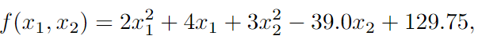
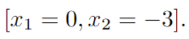

методом Ньютона.
В окрестности точки минимума построить линии уровня и траекторию поиска (на одном графике).За своевременное выполнение задания начисляется 6 баллов .
Теоетическая часть
Каждый шаг большинства основных детерминированных методов приближенного, нахождения точки локального безусловного минимума функции 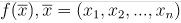 состоит из следующих трех этапов:

Нахождение в данной точке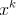  направления  очередного одномерного поиска минимума.
Нахождение шага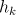  из условия минимума функции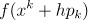 по направлению , начиная от точки .
3) Нахождение очередного- приближения'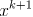 ,согласно формуле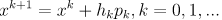

Метод Ньютона
 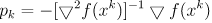

где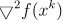 — квадратная матрица порядка ,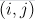-й элемент которой равен 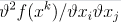

При этом  = 1.

Практическая часть
Алгоритм метода Ньютона:
Шаг 1. Задается начальное приближение для  (в нашем случае n = 2).  
Шаг 2. Вычисляется невязка fvec. Проверяется сходимость (сумма модулей координат fvec меньше некоторого малого eps > 0). Если достигнута сходимость, цикл завершается. Иначе переход к следующему шагу.
Шаг 3. Вычисляются элементы матрицы Якобиана
Шаг 4. Методом Гаусса решается система , где 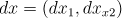  - вектор смещений
Шаг 5. Рассчитывается следующее приближение переменных: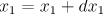 , 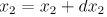
Шаг 6. Переход к следующей итерации (Шаг 1.)

Результаты
В результате работы программы у функции  был найден экстремум в точке [-1;6.5]  ( начальная точка  ) за 3 итерации методом Ньютона с точностью до 6 знака. Ниже приведен рисунок с изображением линий уровня и траектории поиска.

